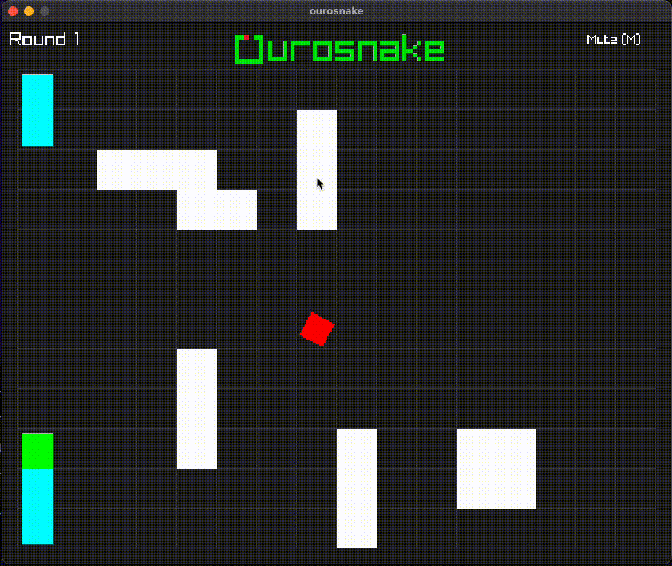
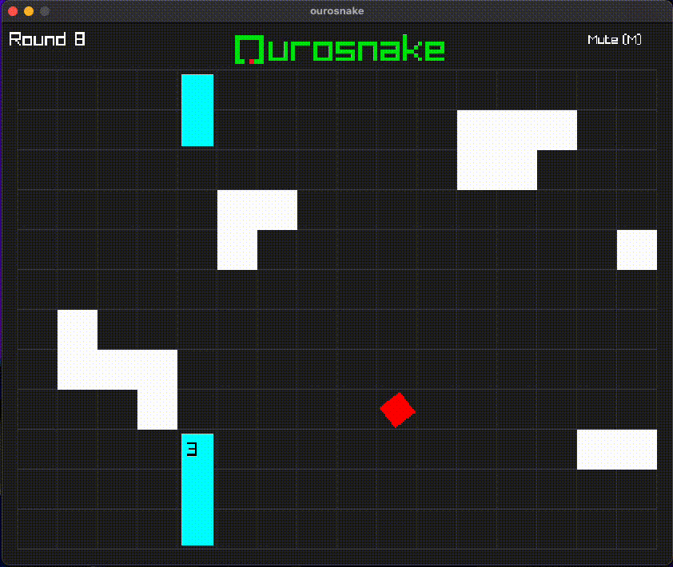

 

A game about a very hungry snake... maybe too hungry 

# Yo infinite snek nice

Grab the appropiate ourosnake file and the assets folder and enjoy!

## Building from source
If you want to compile a custom version of the game, follow the steps below according to your OS:

### Linux setup:
Go into raylib/src, then run `make` 

After that compile and run project with: 
`gcc -Iraylib/src/ -o ./ourosnake ./src/all.c -lraylib -lGL -lm -ldl -lrt -lX11 -Lraylib/src/ -l:libraylib.a && ./ourosnake`

### Mac setup:
Go into raylib/src, then run `make` 

After that compile and run project with: 
`gcc -framework CoreVideo -framework IOKit -framework Cocoa -framework GLUT -framework OpenGL -I ./raylib/src -L ./raylib/src -lraylib ./src/all.c -o ./ourosnake && ./ourosnake`

### Windows setup:
Install mingw-gcc compiler

Download raylib release from github: https://github.com/raysan5/raylib/releases/download/5.5/raylib-5.5_win64_mingw-w64.zip

Extract and rename folder as raylib_win

Build the executable with:
`x86_64-w64-mingw32-gcc ./src/all.c -o ./ourosnake.exe -I ./raylib_win/include -L ./raylib_win/lib -lraylib -lgdi32 -lwinmm -mwindows`

Then run the game by opening ourosnake.exe

#### Notes:
In order to debug don't forget to add the -g flag to the compiler so breakpoints are not ignored :)

Created with [Raylib](https://www.raylib.com/)  
Background music made with [BeepBox](https://www.beepbox.co/)  
Sound effects made with [rFXGen](https://raylibtech.itch.io/rfxgen)  
Logo created in [Piskel](https://www.piskelapp.com/)  

Enjoy :D
